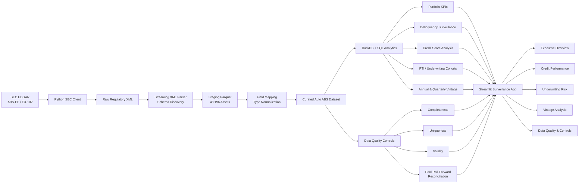

# Structured Finance Data Quality & Surveillance Platform

> An end-to-end Auto ABS data engineering, credit surveillance, and financial-control platform built from public SEC asset-level regulatory filings.

[](https://structured-finance-surveillance.streamlit.app/)
[](https://github.com/JunDeGuzman92/Structured-finance-surveillance/actions/workflows/ci.yml)

This project demonstrates how raw structured-finance regulatory data can be transformed into a validated, analysis-ready dataset and an interactive surveillance application for evaluating collateral performance, borrower credit characteristics, delinquency, vintage behavior, and data quality.

### [Open the Live Dashboard →](https://structured-finance-surveillance.streamlit.app/)

The platform processes **48,196 asset-level auto receivables representing approximately $1.069 billion of current collateral balance** from an SEC ABS-EE / EX-102 filing.

It combines **Python, SQL, DuckDB, Parquet, Streamlit, Plotly, automated testing, and financial reconciliation controls** into one reproducible analytical workflow.

---
## Interactive Application
**Live application:** [Launch the Structured Finance Surveillance Dashboard](https://structured-finance-surveillance.streamlit.app/)

## Dashboard

### Executive Surveillance Overview


The executive view summarizes collateral exposure, loan count, weighted-average interest rate, delinquency performance, charge-offs, and automated data-quality controls.

### Underwriting Risk Surveillance


Borrower credit score and payment-to-income characteristics are combined with observed delinquency performance to identify material underwriting-risk cohorts.

### Data Quality & Financial Controls


The control layer validates asset uniqueness, completeness, balance integrity, source-date parsing, and pool-level principal reconciliation.

---

## Key Portfolio Results

| Metric | Result |
|---|---:|
| Asset-level records | 48,196 |
| Unique assets | 48,196 |
| Current pool balance | ~$1.069B |
| Average current loan balance | ~$22.2K |
| Weighted-average APR | ~21.47% |
| 30+ day delinquency | ~1.03% |
| 60+ day delinquency | ~0.14% |
| 90+ day delinquency | ~0.05% |
| Charged-off principal | ~$69.6K |
| Missing asset IDs | 0 |
| Missing current balances | 0 |
| Negative current balances | 0 |
| Pool roll-forward reconciliation difference | $0.00 |
| Automated tests | 13 passing |

> Metrics are calculated from the current project dataset and represent a point-in-time collateral surveillance view rather than investment advice or a credit rating.

---

## Why This Project

Structured-finance datasets present a different analytical challenge from conventional tabular datasets.

Asset-level regulatory filings may contain deeply nested XML, regulatory field names, mixed types, incomplete metadata, date conventions, and financial relationships that must reconcile before downstream analysis can be trusted.

This project was designed around a simple principle:

**credit analytics are only as credible as the data controls underneath them.**

Instead of starting with a pre-cleaned CSV, the project builds the analytical workflow from the regulatory source layer forward:

**source acquisition → schema discovery → normalization → validation → financial reconciliation → credit surveillance → interactive reporting**

---

## Architecture


---

## Project Structure

```text
structured-finance-surveillance/
│
├── .github/
│   └── workflows/
│       └── ci.yml
│
├── config/
│   ├── deals.yaml
│   └── field_mapping.yaml
│
├── dashboard/
│   ├── app.py
│   ├── shared.py
│   └── pages/
│       ├── executive_overview.py
│       ├── credit_performance.py
│       ├── underwriting_risk.py
│       ├── vintage_analysis.py
│       └── data_quality.py
│
├── data/
│   ├── raw/
│   ├── staging/
│   └── curated/
│
├── docs/
├── sql/
│   ├── marts/
│   └── quality/
│
├── src/
│   └── structured_finance/
│       ├── analytics/
│       ├── database/
│       ├── ingestion/
│       ├── parsing/
│       └── quality/
│
├── tests/
├── pyproject.toml
├── requirements.txt
└── README.md
```

---

## Running Locally

### 1. Clone the repository

```powershell
git clone https://github.com/JunDeGuzman92/Structured-finance-surveillance.git
cd Structured-finance-surveillance
```

### 2. Create a Python 3.12 virtual environment

```powershell
py -3.12 -m venv .venv
.venv\Scripts\Activate.ps1
```

These commands are intended for the VS Code integrated terminal using PowerShell.

Git Bash may also be used, but virtual-environment activation differs:

```bash
source .venv/Scripts/activate
```

### 3. Install dependencies

```powershell
pip install -e .
```

For development and testing:

```powershell
pip install -e ".[dev]"
```

### 4. Launch the dashboard

```powershell
streamlit run dashboard\app.py
```

---

## Testing & Code Quality

Run the automated test suite:

```powershell
pytest -v
```

The current test suite covers:

- expected asset-record count
- asset-ID uniqueness
- mandatory-field completeness
- non-negative balances
- first-payment date parsing
- pool roll-forward reconciliation
- delinquency hierarchy consistency
- Streamlit application startup
- execution of all five dashboard pages

Run static analysis with:

```powershell
ruff check src dashboard tests
```

GitHub Actions automatically runs linting and tests on pushes and pull requests.

---

## Data Source & Provenance

The project uses publicly available U.S. SEC structured-finance regulatory filings.

Current demonstration transaction:

**Exeter Automobile Receivables Trust 2025-1**

- Form: ABS-EE
- Asset data exhibit: EX-102
- Reporting period: December 31, 2024
- Asset class: Automobile Receivables / Auto ABS

Raw SEC files and intermediate staging datasets are excluded from version control.

A curated Parquet dataset is included so that the deployed dashboard and automated tests remain reproducible without repeatedly downloading the original SEC filing.

See [`docs/source_notes.md`](docs/source_notes.md) for source details.

---

## Data Engineering Approach

The pipeline follows a layered architecture:

```text
SEC EDGAR
    ↓
Raw regulatory XML
    ↓
Streaming XML parsing
    ↓
Staging Parquet
    ↓
SQL field mapping and type normalization
    ↓
Curated analytical Parquet
    ↓
DuckDB analytics and financial controls
    ↓
Streamlit surveillance application
```

The EX-102 parser uses streaming XML processing and batched Parquet writes to avoid loading the complete regulatory document into memory.

---

## Financial Control Framework

The platform validates the pool-level principal roll-forward:

```text
Beginning Pool Balance
    - Ending Pool Balance

        compared with

Principal Collected
    + Charged-Off Principal
    + Other Principal Adjustments
```

The current dataset reconciles within a one-cent tolerance.

This control is evaluated independently of the dashboard and is also exposed in the Data Quality & Controls interface.

---

## Analytical Scope

The current implementation supports:

- collateral pool KPIs
- balance-weighted delinquency surveillance
- borrower credit-score segmentation
- payment-to-income analysis
- credit score × PTI underwriting cohorts
- annual first-payment vintage analysis
- quarterly first-payment vintage analysis
- material delinquency-contributor analysis
- data completeness and uniqueness controls
- principal roll-forward reconciliation

---

## Methodology Notes

### Delinquency

Delinquency percentages are balance-weighted point-in-time measures based on current outstanding principal.

### Vintage

Vintage analysis uses the reported **first-payment month**, not an inferred exact origination date.

Month/year source values are normalized internally to the first day of the month strictly for date arithmetic and grouping.

### Payment-to-Income

PTI values are normalized to percentage representation before cohort analysis.

### Materiality

Risk cohorts are evaluated using both delinquency rates and dollar exposure so that very small cohorts do not dominate surveillance conclusions.

---

## Technology Stack

| Layer | Technology |
|---|---|
| Programming | Python 3.12 |
| Query / Transformation | SQL |
| Analytical Engine | DuckDB |
| Storage | Apache Parquet |
| XML Processing | lxml |
| Data Manipulation | Pandas / Polars |
| Visualization | Plotly |
| Application | Streamlit |
| Testing | pytest |
| Static Analysis | Ruff |
| CI | GitHub Actions |
| Source Control | Git / GitHub |

---

## Limitations

This project currently demonstrates one Auto ABS transaction and one reporting snapshot.

It is not:

- an official credit rating
- an investment recommendation
- a cash-flow waterfall model
- a default or loss forecasting model
- an issuer, servicer, rating-agency, bank, or SEC product

The current implementation is intentionally focused on demonstrating the data architecture, analytical workflow, credit-surveillance logic, and financial-control framework.

---

## Future Development

Potential extensions include:

- configuration-driven multi-deal ingestion
- multiple reporting periods per securitization
- roll-rate and delinquency migration analysis
- cumulative net-loss curves
- prepayment analysis
- cross-deal benchmarking
- collateral concentration monitoring
- transaction-level credit enhancement analysis
- waterfall modeling
- additional structured-finance asset classes

---

## Disclaimer

This repository is an independent educational and portfolio project.

All analysis is based on publicly available regulatory information and is provided solely to demonstrate data-engineering and analytical techniques. Nothing in this repository constitutes investment advice, a credit opinion, or a credit rating.
