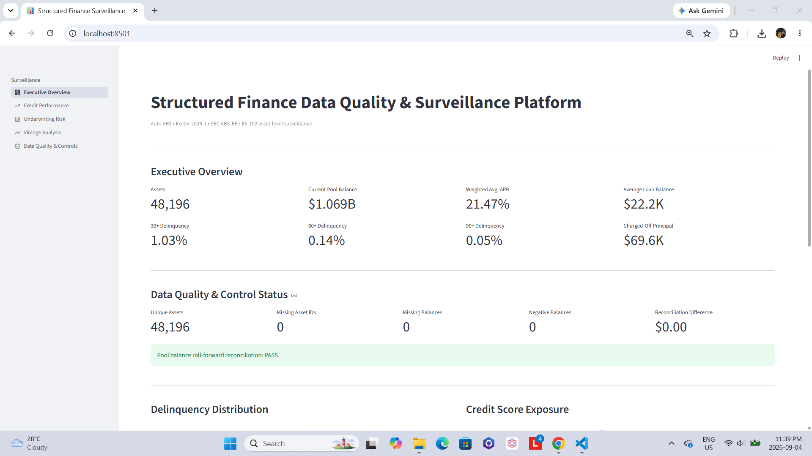
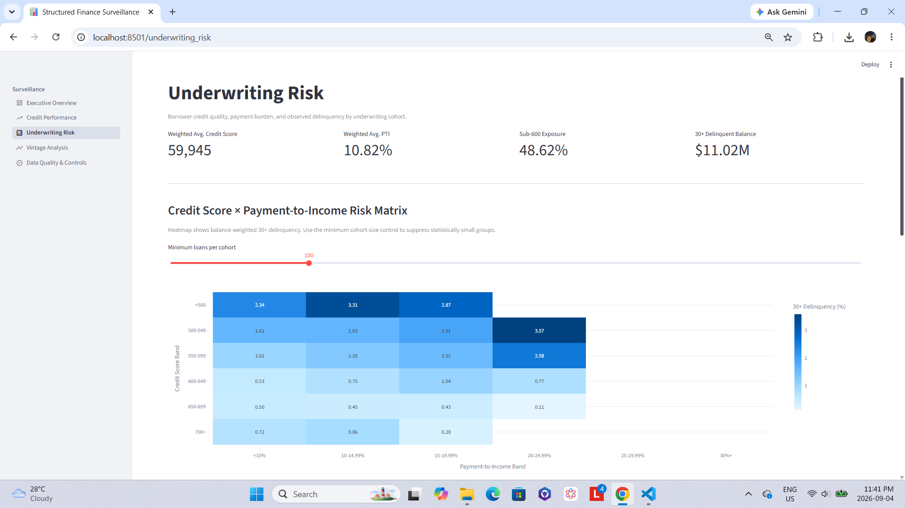
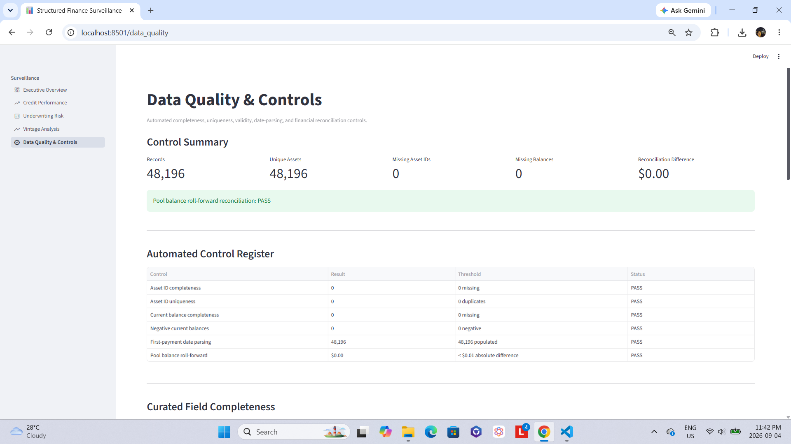
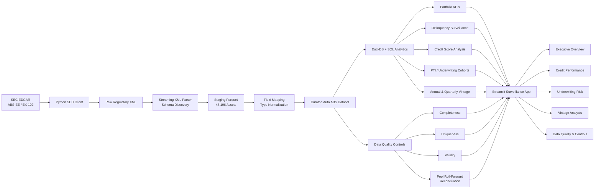

# Structured Finance Data Quality & Surveillance Platform

> An end-to-end Auto ABS data engineering, credit surveillance, and financial-control platform built from public SEC asset-level regulatory filings.

This project demonstrates how raw structured-finance regulatory data can be transformed into a validated, analysis-ready dataset and an interactive surveillance application for evaluating collateral performance, borrower credit characteristics, delinquency, vintage behavior, and data quality.

### [Open the Live Dashboard →](https://structured-finance-surveillance.streamlit.app/)

The platform processes **48,196 asset-level auto receivables representing approximately $1.069 billion of current collateral balance** from an SEC ABS-EE / EX-102 filing.

It combines **Python, SQL, DuckDB, Parquet, Streamlit, Plotly, automated testing, and financial reconciliation controls** into one reproducible analytical workflow.

---
## Interactive Application
**Live application:** [Launch the Structured Finance Surveillance Dashboard](https://structured-finance-surveillance.streamlit.app/)

## Dashboard

### Executive Surveillance Overview

The executive view summarizes collateral exposure, loan count, weighted-average interest rate, delinquency performance, charge-offs, and automated data-quality controls.

### Underwriting Risk Surveillance

Borrower credit score and payment-to-income characteristics are combined with observed delinquency performance to identify material underwriting-risk cohorts.

### Data Quality & Financial Controls

The control layer validates asset uniqueness, completeness, balance integrity, source-date parsing, and pool-level principal reconciliation.

---

## Key Portfolio Results

| Metric | Result |
|---|---:|
| Asset-level records | 48,196 |
| Unique assets | 48,196 |
| Current pool balance | ~$1.069B |
| Average current loan balance | ~$22.2K |
| Weighted-average APR | ~21.47% |
| 30+ day delinquency | ~1.03% |
| 60+ day delinquency | ~0.14% |
| 90+ day delinquency | ~0.05% |
| Charged-off principal | ~$69.6K |
| Missing asset IDs | 0 |
| Missing current balances | 0 |
| Negative current balances | 0 |
| Pool roll-forward reconciliation difference | $0.00 |
| Automated tests | 13 passing |

> Metrics are calculated from the current project dataset and represent a point-in-time collateral surveillance view rather than investment advice or a credit rating.

---

## Why This Project

Structured-finance datasets present a different analytical challenge from conventional tabular datasets.

Asset-level regulatory filings may contain deeply nested XML, regulatory field names, mixed types, incomplete metadata, date conventions, and financial relationships that must reconcile before downstream analysis can be trusted.

This project was designed around a simple principle:

**credit analytics are only as credible as the data controls underneath them.**

Instead of starting with a pre-cleaned CSV, the project builds the analytical workflow from the regulatory source layer forward:

**source acquisition → schema discovery → normalization → validation → financial reconciliation → credit surveillance → interactive reporting**

---

## Architecture

